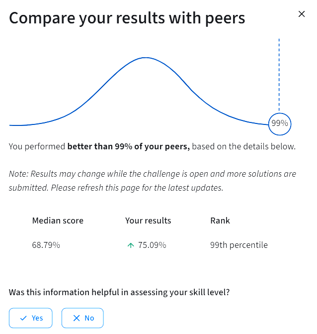

# Churn Prediction

Proyecto de **Data Science y Machine Learning** desarrollado en el contexto de un challenge de Coursera.

El objetivo es predecir la probabilidad de abandono (*churn*) de clientes de un servicio de streaming durante el mes siguiente, utilizando información sobre sus suscripciones, comportamiento y uso del servicio.

## Objetivo

Construir un modelo predictivo capaz de estimar la probabilidad de *churn* para los clientes incluidos en el conjunto de prueba.

El proyecto contempla las principales etapas de un flujo de trabajo de Machine Learning:

```text
Datos
  ↓
Exploración
  ↓
Preparación
  ↓
Feature Engineering
  ↓
Entrenamiento
  ↓
Validación
  ↓
Evaluación
  ↓
Predicciones
```

## Datos

El conjunto de entrenamiento contiene **243.787 registros y 21 variables**, mientras que el conjunto de prueba contiene **104.480 registros y 20 variables**.

El análisis incluye la exploración de las variables disponibles, tratamiento de datos y preparación de las características utilizadas por el modelo.

## Feature Engineering

Como parte del procesamiento se construyeron nuevas variables para representar diferentes aspectos del comportamiento de los clientes, entre ellas:

* `AvgChargePerMonth`
* `DownloadsPerHour`
* `TicketsPerAge`
* `Engagement`
* `HighCostLowUse`
* `Dissatisfaction`

También se aplicaron transformaciones a determinadas variables para mejorar su utilización en el modelo.

## Modelo

Se utilizó un modelo de **Regresión Logística** para estimar la probabilidad de abandono.

Los datos fueron separados en conjuntos de entrenamiento y validación mediante `train_test_split`, utilizando estratificación de la variable objetivo y `random_state=42`.

## Evaluación

El modelo obtuvo un:

**ROC-AUC: 0,7541**

sobre el conjunto de validación.

Posteriormente, el modelo fue entrenado utilizando el conjunto completo de entrenamiento y se generaron probabilidades de *churn* para las **104.480 observaciones** del conjunto de prueba.

### Resultado del challenge

En la evaluación del challenge se obtuvo un resultado de:

**75,09 %**

La plataforma indicó que este resultado correspondía al **percentil 99** entre los participantes al momento de la consulta, con una mediana de **68,79 %**.



> El ranking corresponde al estado informado por la plataforma al momento de la consulta y podía cambiar mientras el challenge permaneciera abierto.

## Notebook

El análisis completo, incluyendo exploración de datos, procesamiento, ingeniería de características, entrenamiento, evaluación y generación de predicciones, se encuentra en el notebook:

**[ChurnPrediction.ipynb](./ChurnPrediction.ipynb)**
**[Ver en Coursera Lab](https://hub.labs.coursera.org/connect/sharedoigfwpjj?forceRefresh=false&path=%2Fnotebooks%2FChurnPrediction.ipynb&sessionMigrationMode=shadow)

## Tecnologías

* Python
* Jupyter Notebook
* Pandas
* NumPy
* Scikit-learn
* Matplotlib
* Seaborn

## Contexto

Este proyecto forma parte de mi formación en **Data Science** y constituye un ejercicio práctico de construcción de un modelo predictivo desde la exploración de los datos hasta la generación de predicciones para un conjunto de prueba.

---

[← Volver a Data Science Training](../)
